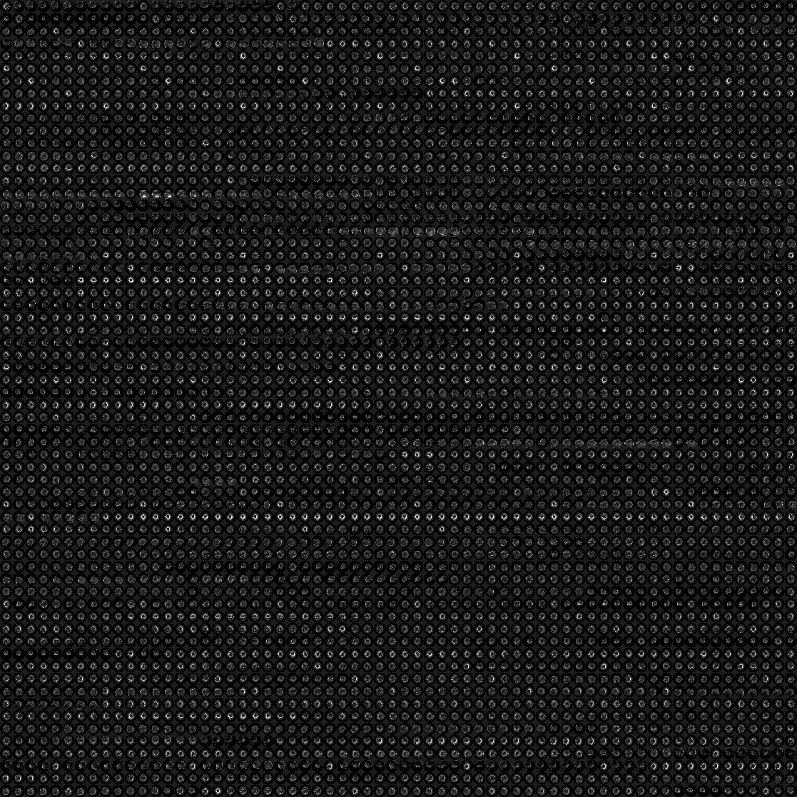

# About
This repository can be used to generate images for use with [tensorflow projector](http://projector.tensorflow.org/). Note this repository just compresses the raw image to the desired vector size and does not actually generate a feature space embedding. 

# Use
In create_embedding.py specify the following:  
**directory**: Directory where images are stored  
** data_file**:Path to a file which contains each image filename (no need to include the absolute file path)  
**num_image_rows**: This number sets the number of images in each row in the sprite image (see example sprite image below). This is the square root of the total number of images  
**image_dim**: The dimension of the images contained within the sprite image. Recommended to not exceed 64x64.  
**embedding_dim**: The embedding dimension of the images. Images are resized to this size and embedding vectors are generated.

Edit *config.json* to set the correct value for the following:  
**tensorShape**: Should be [num_images,  image_dim2].   
**singleImageDim**: The size of single image in the sprite image  
Paths to me the *vecs.tsv*, *metadata.tsv* and *sprite_image.jpg*  

Finally, time to let the projector [run](http://projector.tensorflow.org/?config=https://raw.githubusercontent.com/dmolony3/projector_embedding/master/config.json). 

# Acknowledgements
Inspired by the the following repository
[https://github.com/anthonySegura/facenet_projections](https://github.com/anthonySegura/facenet_projections)
